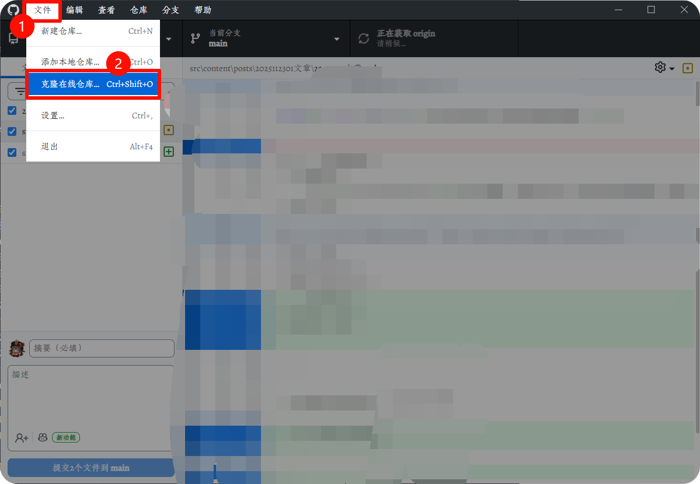
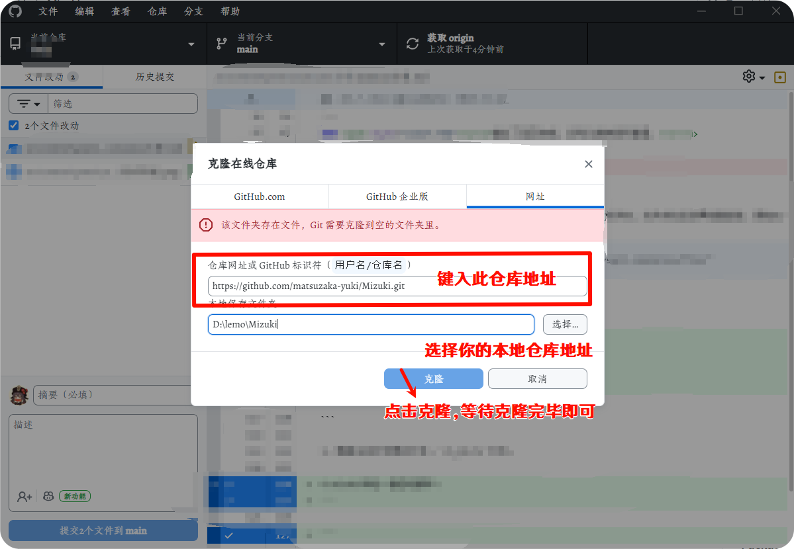
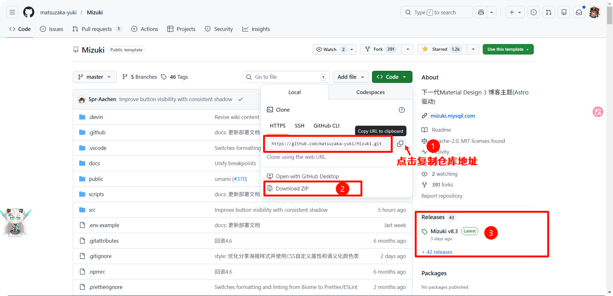

---

### <span style="color:red"><u><i>云朵偷喝了我放在屋顶的酒，于是它脸红变成了晚霞。</i></u>

---

## ✨Mizuki

> - 前言：Astro-theme-Mizuki 是一个基于Astro的现代化静态博客模板，具有丰富的功能和美观的设计，无论您是想写 生活类博客、技术类博客、 或者是 知识库、系列文档 等，主题都可以满足您的需求。---摘自 `<mark>`Matsuzaka-Yuki/官方文档`<mark>`
> - 因为是小白操作，很多步骤都是参考ai和官方文档，所以记录一下，方便以后查看和便捷操作。
> - 也希望可以帮助到刚刚接触到且需要助力的小伙伴们。

## 🐻‍❄️环境配置

**环境依赖**--在开始使用 Mizuki 之前，您需要确保系统满足以下要求：

```
Node.js >= 20
pnpm >= 9
Git(Github desktop)
```

1. 安装 Node.js

- 访问 [Node.js](https://nodejs.org/en/) 官网下载并安装最新版本的Node.js(建议使用 LTS 版本)。
- 不会安装？ :spoiler[🙌难道是笨蛋喵🙌]
  - [Node.js安装及环境变量配置](https://www.bilibili.com/video/BV19F411t7zX/?share_source=copy_web&vd_source=6033adaa90d5b51ef75d809f5668308a)
  - [123网盘直取](https://www.123865.com/s/iMSmjv-qMLo?pwd=0723#)
- 安装完成后，打开终端或命令提示符，运行以下命令验证 Node.js 是否安装成功：

```
node -v
npm -v
/*如果显示版本号，则表示安装成功。*/
```

1. 安装 pnpm
   如果您尚未安装 pnpm，可以通过 npm 安装：

```
npm install -g pnpm

```

---

```
/*安装完成后，打开终端或命令提示符，运行以下命令验证 pnpm 是否安装成功：*/
pnpm -v
/*如果显示版本号，则表示安装成功*/
```

1. 安装 Git

- 访问 [Git](https://git-scm.com/install/) 官网,下载并安装适合您操作系统的 Git 版本。

```
/*安装完成后，打开终端或命令提示符，运行以下命令验证 Git 是否安装成功：*/
git --version
/*如果显示版本号，则表示安装成功。*/
```

## 😽项目启动步骤

**1. 克隆项目**

- 命令行操作：
  克隆 Mizuki 项目到本地：

  ```
  git clone https://github.com/matsuzaka-yuki/mizuki.git
  cd Mizuki
  ```
- Github 操作：

  - 访问 [Mizuki](https://github.com/matsuzaka-yuki/mizuki) 项目主页，点击绿色按钮 `Code`，
    - 1[复制项目链接进行Github Desktop操作](#step2)
    - 2选择 `Download ZIP`下载项目压缩包本地解压使用。
    - 3点击右侧（手机端在页面下面）`Repository`选择合适版本下载 `.zip`文件到本地解压使用。
- <a name="step2"></a>Github desktop 操作：
- 
- 
- ⚠️注意：上述三种步骤均可独立进行，参考图：
  

**2. 安装依赖**

- 使用 pnpm 安装项目依赖：

```cmd
pnpm install
```

**3. 配置博客**

- 在启动项目之前，您需要根据自己的需求进行配置：
  > 编辑 src/config.ts 文件来自定义博客设置
  > 更新站点信息、主题颜色、横幅图片和社交链接
  > 配置翻译设置和特殊页面功能
  >

## 🎉Mizuki 启动！

- 运行以下命令启动开发服务器：

```cmd
pnpm dev
```

启动成功后，点击或浏览器访问本地地址即可看到您的博客

- *一键启动脚本：*

```cmd
@echo off
chcp 65001 >nul
title Mizuki 开发服务器

echo 正在启动开发服务器...
echo.

cd /d D:\lemo\Mizuki

:: 在后台启动 pnpm dev
start "Mizuki Dev" cmd /k "pnpm dev"

echo 等待服务器启动 (端口 4321)...
echo.

:: 等待端口 4321 开始监听
:wait_loop
timeout /t 1 /nobreak >nul
netstat -an | findstr ":4321.*LISTENING" >nul
if %errorlevel% neq 0 (
    goto wait_loop
)

echo 服务器已启动，正在打开浏览器...
echo.

:: 打开默认浏览器
start http://localhost:4321

echo.
echo ✅ 已打开浏览器访问 http://localhost:4321
echo 按任意键退出...
pause >nul
```

⚠️**注意**：以记事本或其他ide新建文件，保存为 `.bat` 格式，将脚本中D:\lemo\Mizuki改为自己的项目路径，双击运行即可。

---