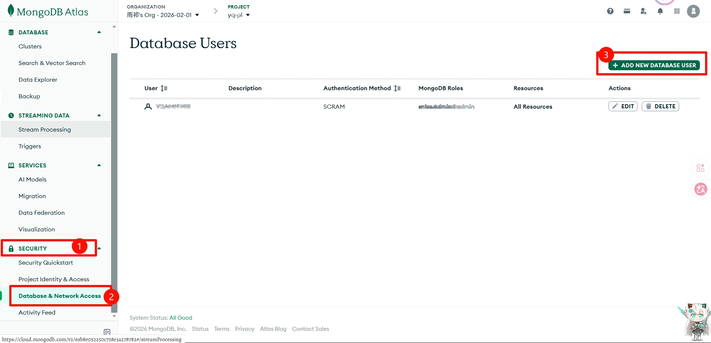
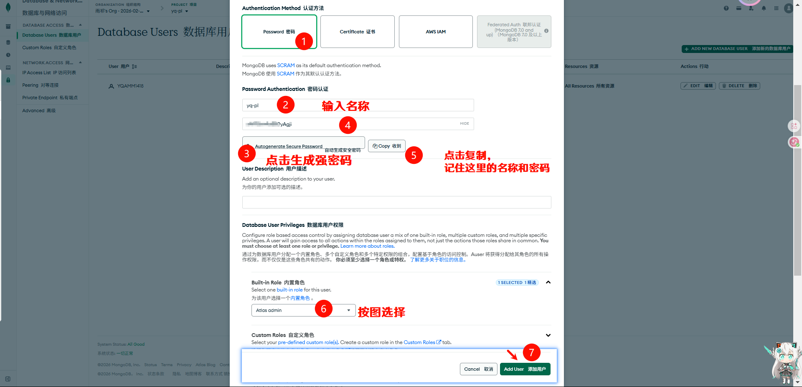
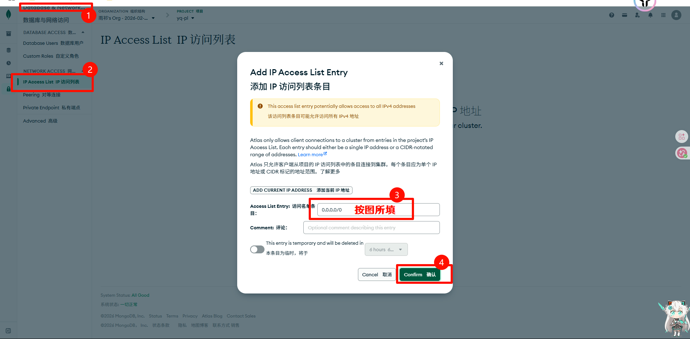
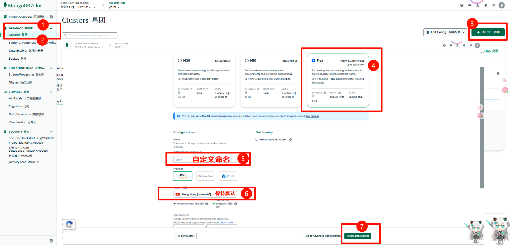
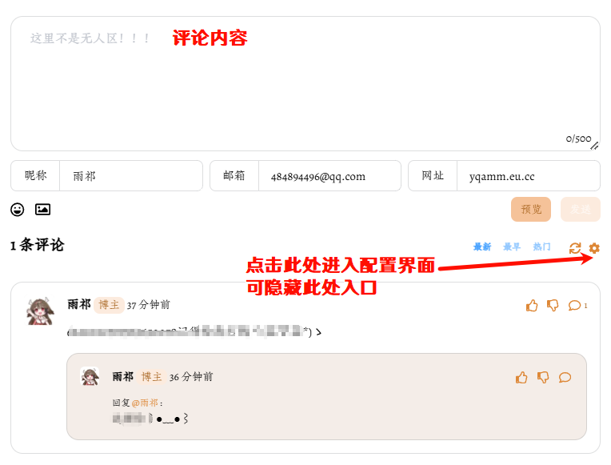
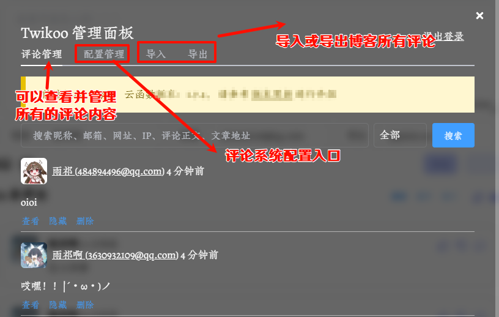
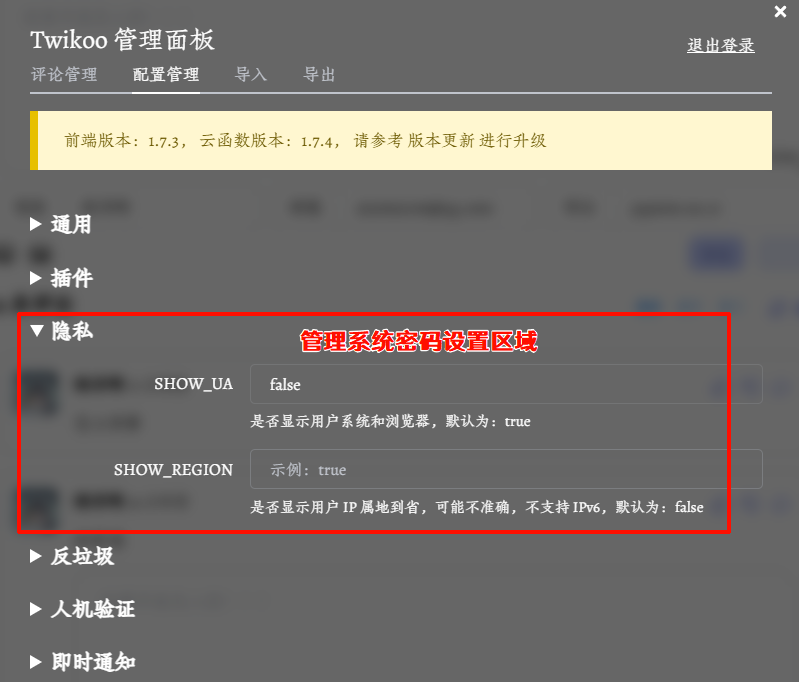
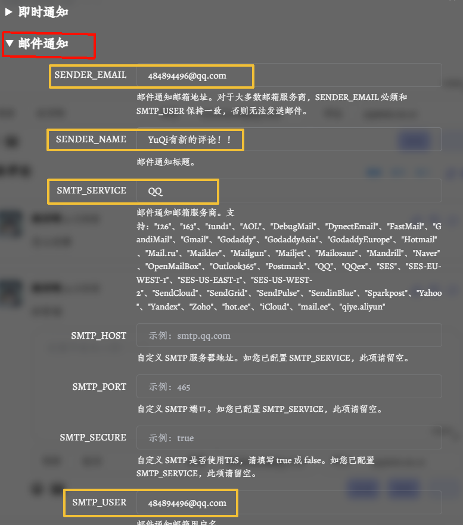
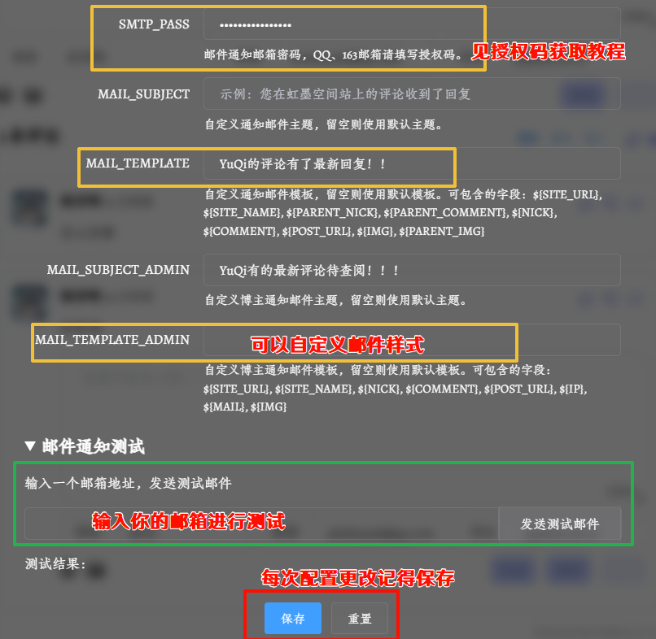

---
### <span style="color:red"><u><i>前路悠悠，愿你我不再孤单。</i></u></span>
---
# Twikoo 评论系统
> 一个简洁、安全、免费的静态网站评论系统。   
> A simple, safe, free comment system.


## ⭐Mizuki评论系统配置
1. Twikoo 评论系统配置位于 `src/config.ts` 文件中的 `commentConfig` 对象，控制博客的评论系统显示设置。

```typescript
export const commentConfig: CommentConfig = {
  enable: false, // 启用评论功能。当设置为 false 时，评论组件将不会显示在文章区域。
	twikoo: {
		envId: "https://xxx.netlify.app/.netlify/functions/twikoo",
		lang: SITE_LANG,
	},
};
```

2. 我们来详细解析 `src/config.ts` 文件中的 `commentConfig` 对象，并为你提供一份配置教程。

   - 这个配置项用于在你的博客中集成 `Twikoo` 评论系统，让你的读者可以在文章下方发表评论和进行互动。

   - 评论系统配置教程:
`commentConfig` 对象是启用和配置 `Twikoo` 评论功能的核心。

3. 核心配置项详解
- 启用评论功能 (enable)
```
enable: false 控制整个评论系统的开关。
配置:
true: 启用评论功能。文章页面将显示 Twikoo 评论区。
false: (默认) 禁用评论功能。评论区将不会在任何页面显示。
```
- Twikoo 具体配置 (twikoo)
```
twikoo: {
		envId: "https://xxx.netlify.app/.netlify/functions/twikoo",
		lang: SITE_LANG,
},

作用: 包含所有与 Twikoo 服务相关的配置。
环境 ID / 部署地址 (envId)
```

- Twikoo 由两部分组成：前端组件（嵌入在你的博客里）和 后端服务（存储评论数据、处理提交请求）。
- envId 就是你后端服务的 URL。  
  
<mark style="background-color: skyblue;">示例值说明-envId: <a id="two"> https://xxx.netlify.app/.netlify/functions/twikoo</a></mark>   
这是最重要的配置项。它告诉你的博客前端，去哪里获取和提交评论数据。它的值是你 Twikoo 服务端的<u>部署地址</u>。是 Twikoo 官方提供的一个演示服务地址。你不应该在生产环境中使用它，因为它有访问限制，且数据不保证持久。


## 🌟Twikoo 配置
1. 部署 Twikoo 服务端
- 部署 Twikoo 服务Twikoo 分为云函数和前端两部分，若要在您的网站上集成 Twikoo，您需要同时部署云函数和前端，部署时请注意保持二者版本一致。
- 如果您的网站主题支持 Twikoo，您只需在配置文件中指定 Twikoo 即可；<br>如果您的网站主题不支持 Twikoo，您需要修改源码手动引入 Twikoo 的 js 文件并初始化。
若您已部署旧版本 Twikoo，请参考 版本更新 升级云函数和前端版本。
- 前端部署 Twikoo 服务端教程，请参考[官方文档](https://twikoo.js.org/frontend.html)。
2. 以下介绍在`Netlify` 部署：其他云函数部署 Twikoo 服务端教程，请参考[官方文档](https://twikoo.js.org/backend.html)。

## 📍Twikoo 部署

>⚠️Netlify 部署的环境需配合 1.4.0 以上版本的 twikoo.js 使用Netlify 免费等级（Functions Level 0）支持每月 125,000 请求次数和 100 小时函数计算时长.
<details>
<summary><a id="one"><strong>1. MongoDB 连接字符串的获取</strong>(回来就看这个笨蛋喵)</a></summary>

- 申请 [MongoDB AtLas 账号](https://www.mongodb.com/cloud/atlas/register),获取 `MongoDB` 连接字符串-有`Github`账号可以直接登录，没有可以用邮箱注册。
- 创建免费 `MongoDB `数据库，区域推荐选择离 Twikoo 后端（Vercel / Netlify / AWS Lambda / VPS）地理位置较近的数据中心以获得更低的数据库连接延迟。<u>*如果不清楚自己的后端在哪个区域，也可选择 AWS / Oregon (us-west-2)，该数据中心基建成熟，故障率低，且使用 Oregon 州的清洁能源，较为环保.*</u>
### #创建个人账户
- 在 `SECURITY`-`Database &NetworkAccess` 页面点击 `Add New Database User` 创建数据库用户.


### #创建个人项目和密码
- 在 `Password Authentication` 下设置数据库用户名和密码，建议点击 `Auto Generate` 自动生成一个不含特殊符号的强壮密码并妥善保存。
- 点击 `Database User Privileges` 下方的 ` Built In Role`，`Select Role` 选择 `Atlas Admin`，最后点击 `Add User`.
 
### #添加网络白名单
- 在 `Database &NetworkAccess` 页面点击 `IP Address List IP` 添加网络白名单。因为 `Vercel / Netlify / Lambda` 的出口地址不固定，因此 `Access List Entry` 中输入 `0.0.0.0/0`（允许所有 IP 地址的连接）即可。如果 Twikoo 部署在自己的服务器上，这里可以填入固定 IP 地址。点击 `Confirm` 保存.
### #获取数据库连接字符串
 
- 在 `Database` 页面点击 `Clusters`:
  - 选择右侧`free`，输入自定义Name，其余部分保存默认。
  - 
  - 连接方式选择 `Drivers`，并记录数据库连接字符串，请将连接字符串中的 `<username>`:`<password>` 修改为刚刚创建的数据库 `用户名/密码`,注意去除 `<>` 符号.


- 如有疑问，请详细参阅[MongoDB Atlas](https://twikoo.js.org/mongodb-atlas.html) 
- （可选）默认的连接字符串没有指定数据库名称，Twikoo 会连接到默认的名为 test 的数据库。如果需要在同一个 MongoDB 里运行其他业务或供多个 Twikoo 实例使用，建立加入数据库名称并配置对应的 ACL。<br>

   ⚠️请注意:连接字符串包含了连接到 MongoDB 数据库的所有信息，一旦泄露会导致评论被任何人添加、修改、删除，并有可能获取你的 SMTP、图床 token 等信息。请妥善记录这一字符串，之后需要填入到 Twikoo 的部署平台里。
</details>

<details>
  <summary><strong>2.Netlify配置</strong></summary>

- 申请并登录 [Netlify](https://app.netlify.com/) 账号<br>
- 可用`邮箱注册`或用`github`登录并创建一个 `Team`
- 打开 [twikoojs/twikoo-netlify](https://github.com/twikoojs/twikoo-netlify) 点击 `fork` 将仓库 fork 到自己的账号下

- 回到 `Netlify`，点击 `Add new site` - `Import an existing project`

- 点击 `Deploy with GitHub`，如果未授权 `GitHub` 账号，先授权，然后选择前面 fork 的 `twikoo-netlify` 项目

- 点击 `Add environment variables` - `New variable`，Key 输入 `MONGODB_URI`，Value 输入前面记录的<mark>数据库连接字符串</mark>[什么？你还不会,那就回去再看一遍😡](#one	)，点击 `Deploy twikoo-netlify`	

⚠️切记：连接字符串中的 `<username>`:`<password>` 修改为刚刚创建的数据库 `用户名/密码`,注意去除 `<>` 符号.
- 部署完成后，点击 `Site settings` - `Domain settings` - 右侧 `Options` - `Edit site name`，可以设置属于自己的域名(非必要，但是为了好辨认，建议设置为和项目名称一致)`（https://xxx.netlify.app）`	

- 进入 `Site overview`，点击上方的链接，如果环境配置正确，可以看到 `Twikoo 云函数运行正常` 的提示

- 云函数地址`包含 https:// 前缀和 /.netlify/functions/twikoo 后缀`例如 `https://xxx.netlify.app/.netlify/functions/twikoo` 即为您的环境 id.
- [将此处的`https://xxx.netlify.app/.netlify/functions/twikoo`填入 `src/config.ts` 文件中的 `commentConfig.twikoo.envId` 字段即可完成配置。](#two)
</details>

## 🧲Twikoo基础配置
<details>
 <summary><strong>点击查看</strong></summary>

1.  如图所示进入配置界面,可以设置自己的密码,便于后期管理评论。
- 
2. 输入密码进入配置面板。
-  
- <kbd>评论管理</kbd> 页面可以管理评论，包括删除评论、屏蔽评论、屏蔽用户、设置评论置顶等功能，这里不做赘述。
- <kbd>配置管理</kbd>页面可以设置评论区的样式、评论字数限制、评论排序方式等，仅展示`隐私设置`和`邮件通知设置`。
   - *隐私设置：*
   - *邮件通知：*配置相关内容如图黄框显示(更改为个人实际内容即可)，其余可以保持默认。
   - [查看授权码获取方法](https://help.mail.qq.com/detail/106/985)
   - 输入个人邮箱，可进行测试。
- 确认无误后，保存配置。

</details>

## 🧫Twikoo 更新
>针对 *Netlify* 部署的更新方式
- 登录 `Github`，找到部署时 <kbd>fork</kbd> 到自己账号下的名为`twikoo-netlify` 的仓库
- 打开 `package.json`，点击编辑
- 将 `twikoo-netlify`: `latest` 其中的 `latest` 修改为[最新版本号](https://github.com/twikoojs/twikoo/releases) 。点击`Commit changes`
- 部署会自动触发
>针对*Twikoo*的更改
- 在项目目录下找到：...\Mizuki\src\components\comment\Twikoo.astro
- 修改以下代码：
  
```
<div id="tcomment"></div>
<script is:inline src="/scroll-protection.js"></script>
<script 
    is:inline 
    src="https://s4.zstatic.net/npm/twikoo@《1.7.3》/dist/twikoo.min.js"></script>
<script is:inline define:vars={{ config }}>

```
- 将`<1.7.3>`整体修改为`新版本的版本号`


   