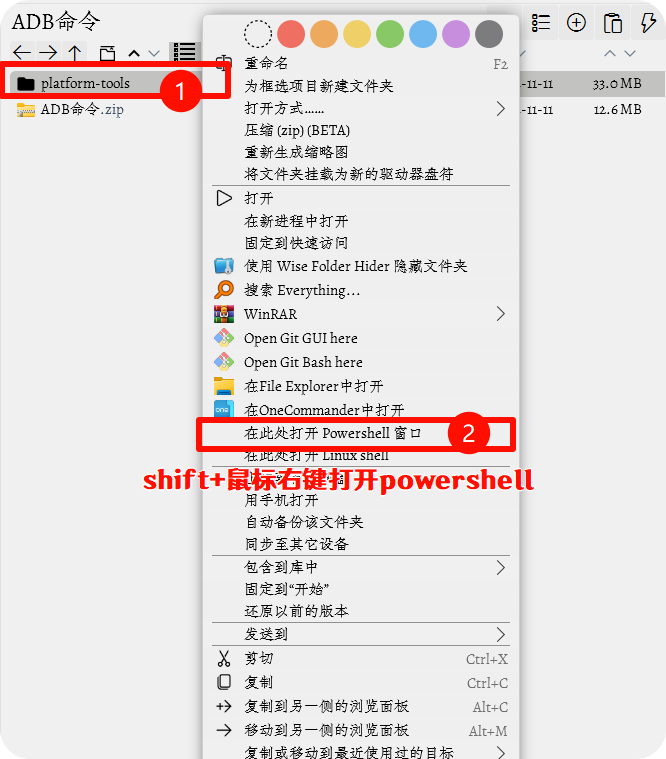
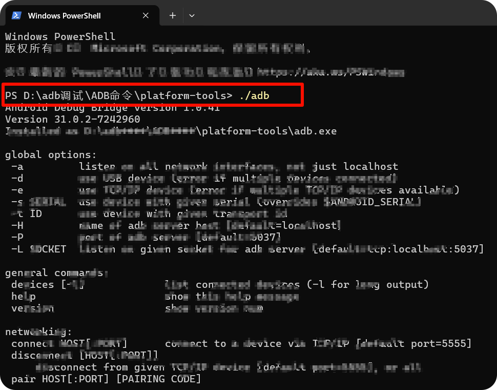
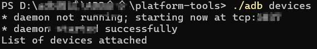
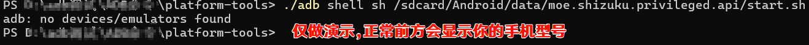

---

### <span style="color:red"><u><i>人间不会有单纯的快乐，快乐总夹杂着烦恼和忧虑，人间也没有永远。--杨绛。</i></u>

---

## Shizuku 介绍
>对于一些不愿意放弃系统高级权限的用户来说，如果官方不能解BL锁（比如小米澎湃OS 新机型、vivo手机、华为手机、荣耀手机、OPPO部分机型等），想玩机的话就得学学 Shizuku 的使用方法了。
>shizuku:是指 Android 开源工具，用于无需 Root 权限访问系统 API。
---

## 简介
- **功能**‌：允许普通应用通过 ADB 权限直接调用系统 API，无需 Root 权限，简化开发和使用。‌‌

- **‌工作原理**：通过运行一个具有更高权限的 Java 进程作为中间人，接收应用请求并转发给系统服务器。‌‌

- **‌使用场景**‌：适用于 Android 开发者和进阶用户，提供系统级权限管理
图片

- **特点**：
   1. 不解BL锁也能玩机，Shizuku基础使用攻略：让应用使用adb高级权限
   2. 无法解锁ROOT、还没有电脑？别急，教你只用手机激活 Shizuku 高级权限
---
## 使用
> 申明：首先要说明的是，Shizuku 本质是 ADB 权限管理器，并不是<mark>最高级的 ROOT 权限</mark>！

### 下载安装shizuku
- [访问官方下载页面](https://shizuku.rikka.app/zh-hans/download/)
- [访问安装-123盘](https://www.123865.com/s/iMSmjv-NwLo?pwd=0723#)
- &#x2139;&#xfe0f; **提示**：shiuku 版本随时更新，请按照个人需求下载对应版本。

### Shizuku 使用方法
>Shizuku 默认提供了【通过连接电脑启动（ADB）】、【通过无线调试启动】、以及【ROOT启动】三种激活方式。下面介绍【通过连接电脑启动（ADB）】和【通过无线调试启动】的激活方式。

<details>
<summary><span style="color:red"><strong>1.通过无线调试启动：</strong></span></summary>

>通过无线调试启动适用于 Android 11 或以上版本。这种启动方式无需连接电脑。由于系统限制，每次重新启动后都需要再次进行启动步骤.

*如何开启开发者选项*
- 打开手机的设置，点击`关于/关于手机`相关，找到`软件版本`，连续点击7次，直到提示你已成为开发者。
- 找到开发者选项，开启 USB 调试。
- 不同手机厂商的开发者选项可能不同，请自行查找。


*配对手机*
- **在 Shizuku 内开始配对**
- 
- **启用无线调试**
- **点按“无线调试”中的“使用配对码配对设备”**
- 
- **在 Shizuku 的通知中填入配对码**
- 
- **启动 Shizuku**
- 
</details>

<details>
<summary><span style="color:red"><strong>2.通过连接电脑启动（ADB桥）</strong></span></summary>

>该启动方式适用于未 root 且运行 Android 10 及以下版本的设备。很不幸，该启动方式需要连接电脑。由于系统限制，每次重新启动后都需要再次进行启动步骤。

>什么是 adb？
Android 调试桥 (adb) 是一个通用命令行工具，其允许您与模拟器实例或连接的 Android 设备进行通信。它可为各种设备操作提供便利，如安装和调试应用，并提供对 Unix shell（可用来在模拟器或连接的设备上运行各种命令）的访问。


1. 在电脑上下载[ADB 命令包.zip并解压](https://www.123865.com/s/iMSmjv-NwLo?pwd=0723#)。
2. 打开手机的开发者选项，启用 USB 调试。
3. 将手机用数据线连接到电脑，选择`仅充电`，打开命令行工具，输入以下命令：
4. 打开文件夹，右键选择：
   - Windows 10：在此处打开 PowerShell 窗口（需要按住 Shift 才会显示该选项）
   - Windows 7：在此处打开命令行窗口（需要按住 Shift 才会显示该选项）
   - Mac 或 Linux：打开 Terminal（终端）
   - 输入以下命令： 
   - 
```
 adb
  
```
*--输入 adb 如果可以看到一长串内容而不是提示找不到 adb 则表示成功--*
- 
>&#x2139;&#xfe0f; **提示**
请不要关闭该窗口，后面提到的“终端”都是指此窗口（如果关闭请重新进行上述步骤）。


5. 成功后再次在终端中输入 
```
adb devices
```
*--如无问题将会看到类似如下内容--*
```
List of devices attached
XXX      device
```
- 
6. 成功后再次输入以下命令：
```
adb shell sh /sdcard/Android/data/moe.shizuku.privileged.api/start.sh
```
- 
7. 等待 Shizuku 启动成功即可。
  
> &#x26a0;&#xfe0f; **警告**
> 如果使用 PowerShell 或是 Linux 及 Mac，所有 adb 都要替换成 ./adb,部分手机机型adb无法正常使用也可以用./adb 替换。
</details>

---
## 搭配使用的软件
<details>
<summary><span style="color:red"><strong>应用推荐</strong></span></summary>

**权限管理与隐私保护**

*<u>1、App Ops (权限管理神器)</u>*
功能：   
Android 原生权限管理非常粗糙（只有允许/不允许）。App Ops 可以实现“模糊定位”、“仅前台允许”等细粒度权限控制，甚至可以“欺骗”应用让它以为你给了权限（如返回空通讯录）。  

<u>2、使用方法：</u>  

安装并激活 Shizuku。
打开 App Ops，会提示请求 Shizuku 授权，点击“允许”。
进入主界面，点击任意应用（如微信、淘宝）。
你可以看到详细的权限列表（如读取通讯录、定位、剪贴板读取等）。
实战技巧： 对于不想给定位但又必须打开的 App，将“位置”权限设置为“忽略”或“模糊定位”，App Ops 会返回一个空数据或假数据，防止隐私泄露。


*<u>1、Lily (应用蛀牙/连锁启动管理)</u>*
功能：   
监控并阻止应用之间的互相唤醒（链式唤醒）。比如你打开淘宝，淘宝可能会唤醒支付宝，支付宝又唤醒微博。  

<u>2、使用方法：</u>   

授予 Shizuku 权限。
开启 Lily 的服务，它会列出所有应用间的唤醒关系。
你可以直接点击切断某些应用被唤醒的通道。

**系统优化与清理**

*<u>1、黑阈 / 冰箱 / Isländ (应用冻结工具)</u>*
功能：   
彻底冻结（禁用）你不常用的预装软件或第三方 App。被冻结的 App 不会后台运行、不耗电、不占内存，图标也会消失，直到你手动解冻。

<u>2、使用方法：</u>    

打开软件，授权 Shizuku。
冰箱： 勾选你想冻结的应用，点击“冻结”。
黑阈： 相比冰箱功能更激进，可以设置“待机智能冻结”或“后台自动冻结”。
解冻： 在软件内点击应用即可解冻启动，用完自动冻结。


*<u>1、SD Maid SE (深度清理工具)</u>*
功能：   
比 Android 自带的清理工具强百倍。它可以扫描应用缓存、重复文件、甚至是卸载残留的“尸体”文件。  

<u>2、使用方法：</u>  

授予 Shizuku 权限（这是扫描 /data 等目录的关键）。
点击“扫描”。
扫描完成后，勾选“系统清洁”、“应用清洁”等项目。
注意： 给予如此高的权限要小心，新手建议只清理它推荐的项目，不要误删系统文件。

**备份与数据迁移**

*<u>1、Swift Backup (快速备份)</u>*
功能：   
无需 Root 即可备份应用及其数据（包括聊天记录、游戏存档）。比传统的钛备份更现代，支持云备份。  

<u>2、使用方法：</u>  

打开应用，授权 Shizuku。
在设置中配置备份存储位置。
勾选需要备份的应用，点击“备份”。
恢复： 换手机或重刷系统后，装好 Shizuku 和 Swift Backup，即可一键恢复所有应用和数据

**系统界面修改 (需注意风险)**

*<u>1、Thanox (安卓工具箱)</u>*
功能：   
极其强大的系统修改工具，可以修改后台管理策略、假装是 Pixel 手机（为了某些 GMS 功能）、伪装设备信息等。  

<u>2、使用方法：</u>   

授权 Shizuku。
进入“情景模式”或“配置”。
实战技巧： 可以使用“权限标记”功能，伪造开发者选项状态，或者对特定 App 开启“强制深色模式”等。
*<u>1、Pixelify / GMS Manager</u>*
功能： 让非 Pixel 手机（如小米、三星）也能使用 Google 相册的无限制备份、Google Now 页面等。  

<u>2、使用方法：</u>    

通过 Shizuku 授权后，这些模块可以修改系统底层的 build.prop 或 GMS 配置，无需刷入 Magisk 模块。

**文件管理**

*<u>1、MiXplorer (文件管理器)(文件管理器)</u>*

功能：   
安卓端最强大的文件管理器。配合 Shizuku，它可以读写 /data 分区，访问受保护的文件，或者直接访问外置 SD 卡的任意目录（无需 SAF 框架的卡顿）。  

<u>2、使用方法：</u>   

设置 -> 开启“使用 Root/ADB 访问”。
授权 Shizuku 后，侧边栏会出现特殊的目录入口，可以查看受保护的应用数据目录（仅限调试包或已授权）


