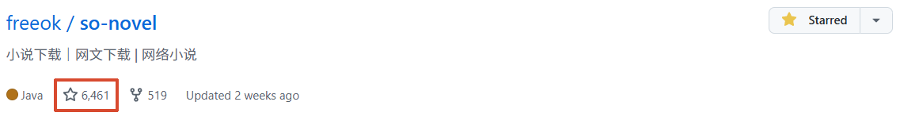
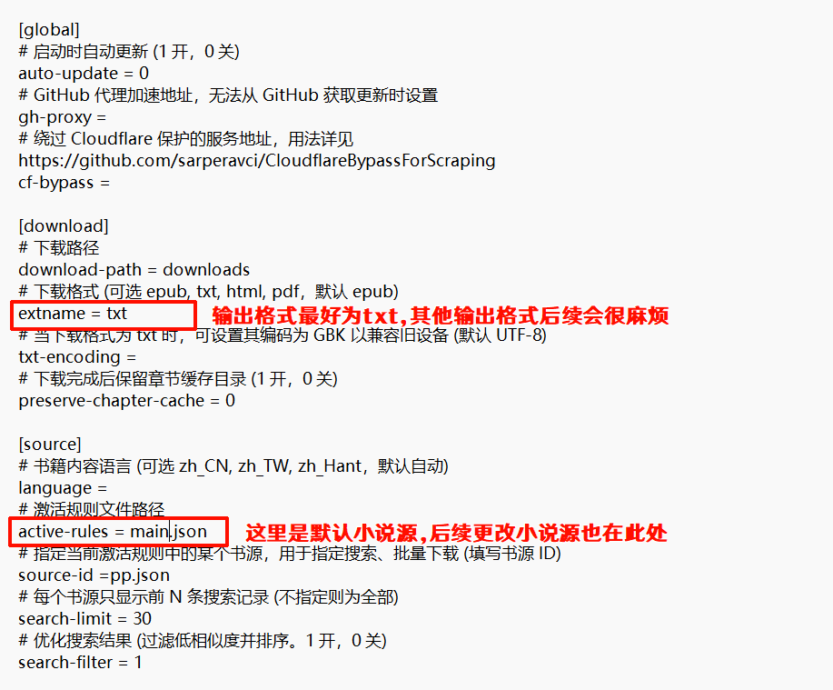
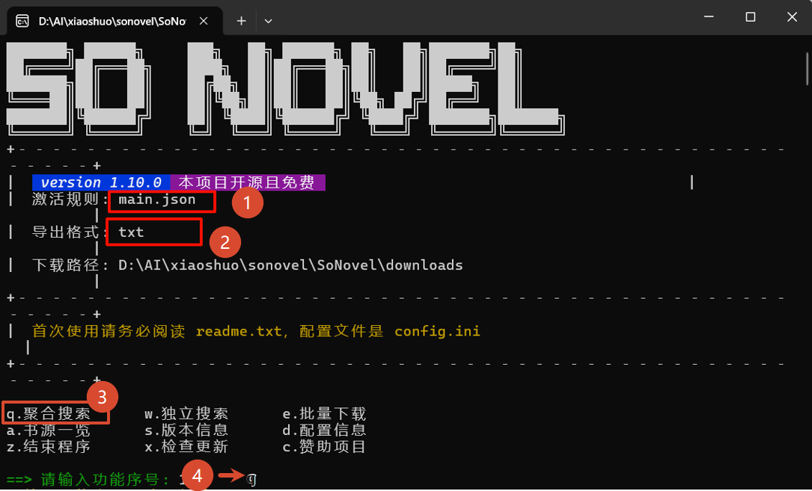
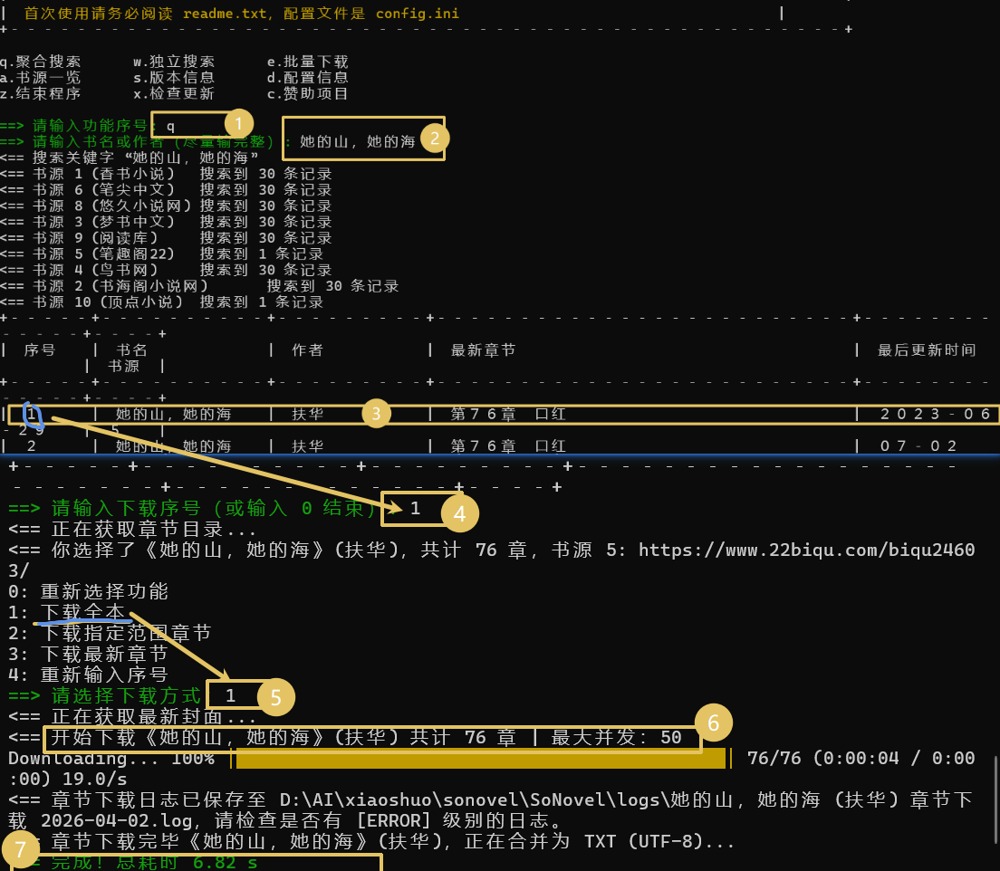
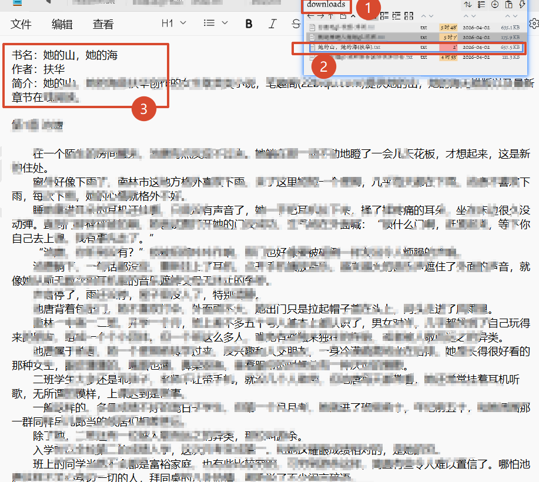
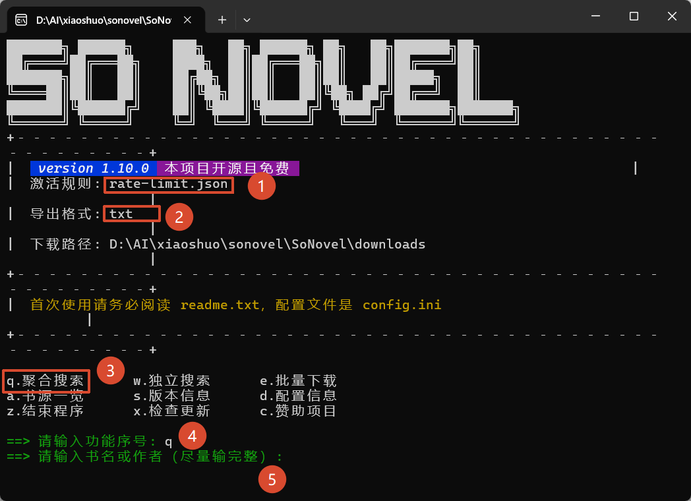
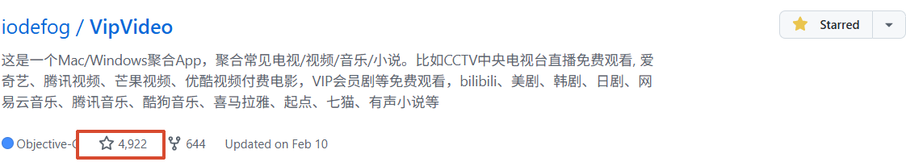

### <span style="color:red"><u><i>人间不会有单纯的快乐，快乐总夹杂着烦恼和忧虑，人间也没有永远。--杨绛。</i></u>

---
## 📁So-Novel
>**写在前面**：
网络小说分类广泛，既让人琳琅满目，又让人沉迷其中。但是因为不可抗力，网络小说在浏览器阅读的同时会弹出令人厌烦的广告。一不注意就跳转到令人尴尬的页面。想要下载内容到本地阅读但是却有一定的限制。于是便想发挥github神力，找到了一款高效免费的小说下载器——`So-Novel` 。

### STAR星图

::github{repo="freeok/so-novel"}
### 简单介绍
1. 支持多种格式：txt、epub、mobi、azw3、pdf等
2. 小说源丰富，囊括主流小说网站
3. 支持小说源自定义/内置源自主切换
4. 无需复杂命令，简单操作
5. 多源下载，可同时下载多个网站的小说
6. 占用小，下载快，自动生成存储文件夹，方便预览
7. 内置操作文档，小白轻松上手

### 操作示例
1. 访问[SO-Novel](https://github.com/freeok/so-novel)，下载安装系统对应版本
>[!tip]
以上github链接如无法正常打开，点击[123网盘](https://www.123865.com/s/iMSmjv-TSLo?pwd=0723#)加速获取
2. 打开`readme.txt`文件查看具体注意事项。
3. 打开`so-novel.exe`，按照对应的功能按键进行输入。
4. 输入小说名或作者名选择对应功能键，确认后进行下载。
5. 等待下载完成，即可在本地阅读。

<details>
<summary><span style="font-weight:bold;font-size:1em">举例演示</summary>

>以小说《她的山，她的海》为例，一般情况下，该小说无法直接下载本地。
- 解压下载的压缩包,首先阅读`readme.txt`文件，了解各项配置项的作用.
- 双击或右键记事本打开`config.ini`，进行基础配置:
    - 打开`config.ini`,修改默认文本输出格式为`txt`.
    
    - 确认默认小说源为`main.json`.
- 确认完毕后双击打开`so-novel.exe`.

- 在提示框光标后输入`q`全局搜索回车--输入`小说名或作者`回车--
自动检索出小说.
- 检索完毕后确认是你想要的小说后键入`0-5`进行下载或重新选择功能.


- 下载完毕后，在同目录的`download`文件夹下，可以看到下载的小说文件.

>[!note]
默认小说源为`main.json`，再该源下如没有找到你想要的小说，可自行修改为其他内置源，复制其名称即可。

- 打开`config.ini`文件，找到
```ini
# 激活规则文件路径
active-rules = main.json
```
- 修改字符`main.json`为`xxx.json`，重启软件即可。
- 例如修改为`rate-limit.json`


</details>

### 自定义书源
1. 通过 rules/rule-template.json5 理解 rules/main.json
2. 打开对应网页，按快捷键 <kbd>Ctrl + Shift + C</kbd>，单击对应元素后
3. 在开发者工具右击此元素，依次选择复制、复制 selector 或 Xpath
4. 将复制内容粘贴到 rules/rule-template.json5 对应属性
5. 将模板文件 rule-template.json5 重命名为 xx.json (可选)
6. 使用，在 config.ini 修改 active-rules = xx.json
---


## 💻EchoMusic
>**写在前面**：
你是否意识到，随着互联网的发展，国内视频网站/app越来越多，以抖音，快手，bilibili视频网站为主的互联网时代快速发展，软件逐渐复杂繁琐，厂家为了推销自己的软件，简单网页可以搞定的事情非得强制下载他们的APP，不同的视频可能还会在不同的平台有不同的观感，且频繁切换软件让人感到十分头疼。于是，我找到了一款高效免费的音视频聚合器——`EchoMusic`.

### STAR星图

::github{repo="iodefog/VipVideo"}
### 简单介绍
1. 这是一个Mac/Windows聚合App，聚合常见电视/视频/音乐/小说.
2. <del>CCTV中央电视台</del>直播免费观看.
3. 集合<del>爱奇艺、腾讯视频、芒果视频、优酷视频bilibili、美剧、韩剧、日剧、网易云音乐、腾讯音乐、酷狗音乐、喜马拉雅、起点、七猫、有声小说</del>等主流视频平台.
4. 后台占用小，反应快，一键切换不同的平台.
### 简单操作
1. 访问[EchoMusic](https://github.com/iodefog/VipVideo)，下载安装系统对应版本.
>[!tip]
以上github链接如无法正常打开，点击[123网盘](https://www.123865.com/s/iMSmjv-dSLo?pwd=0723#)加速获取
2. 解压压缩包，打开`VipVideo.exe`即可使用.
3. 点击视频下方的按钮，切换不同的视频平台.