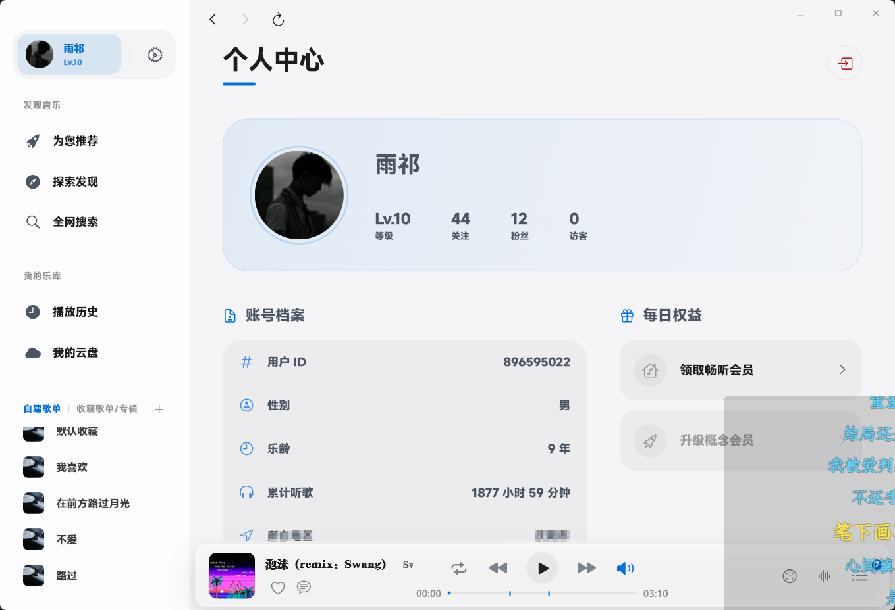
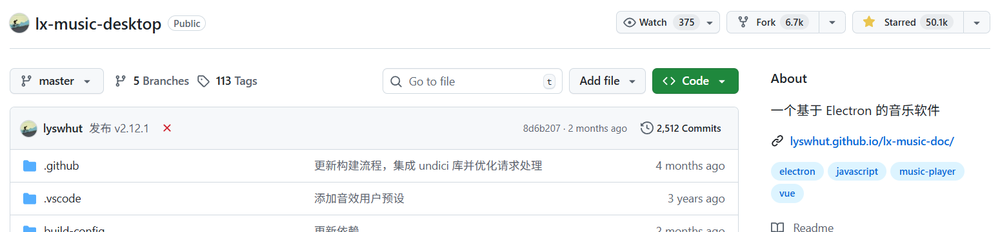
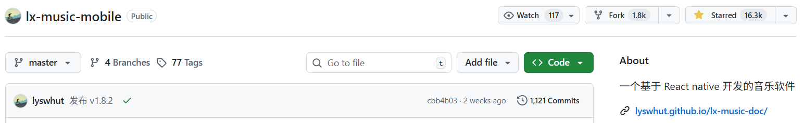
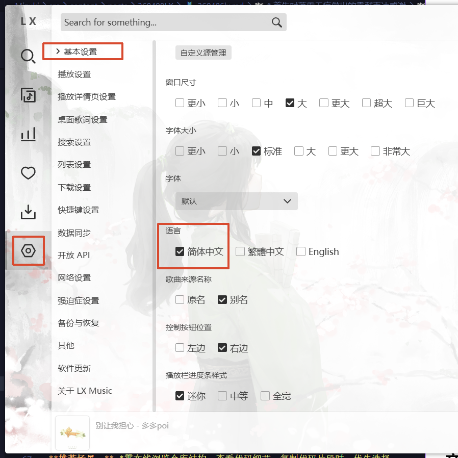
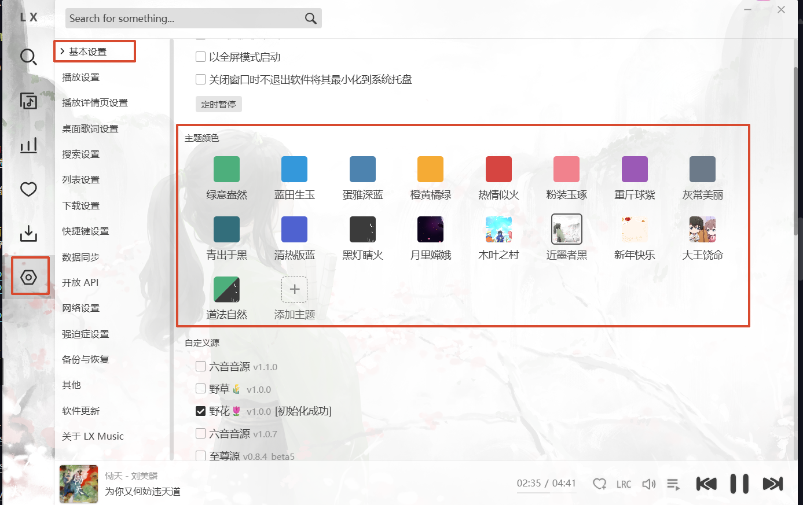
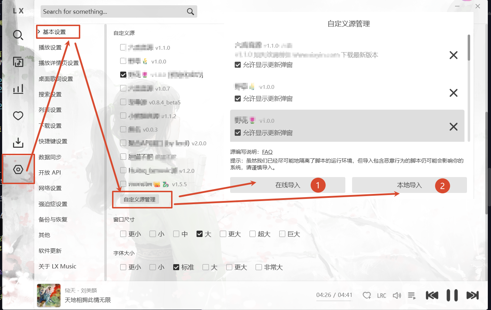
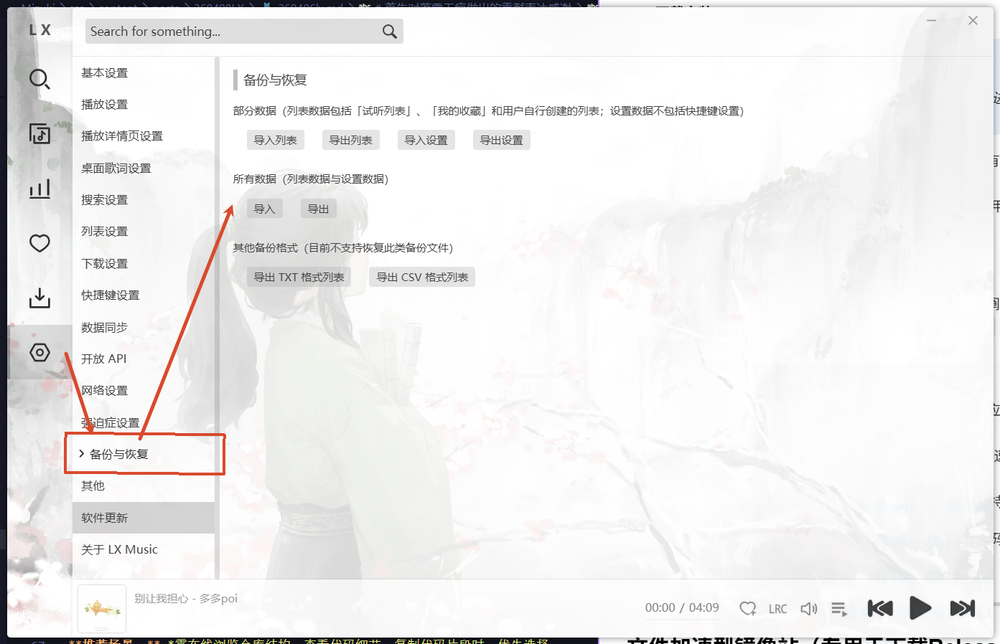
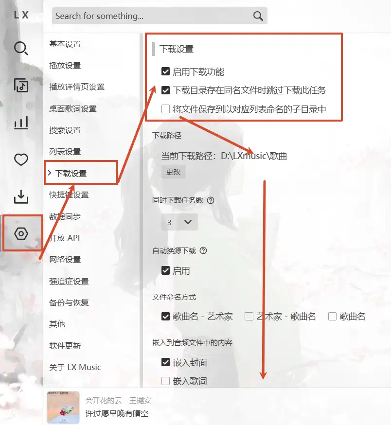
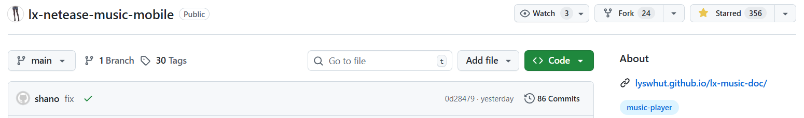

---

### <u><i>此时相望不相闻，愿逐月华流照君.</i></u>

---

**小声哔哔**   
<del>国内很多听曲的软件，强如kg，kw，wyy，qq等，这都是老牌蘸酱，kg可以说我用了近10年，初中晚上用小破机下载的kg，带着联线耳机可以听一整晚。但是慢慢的，这些东西的嘴脸就越来越难看，越来越不好用，各种收费，限制会员。恶心的我一度放弃了这款软件和听音乐的念头，好在后面出了kg极速版，每天一个会员，还算可以吧！将就用了一段时间，发现了另外一个开源音乐软件--LIUYIN，这就开启了一条不归路，一直到高一完，很遗憾的是，因为开源免费，难以维持后续维护导致了软件关停。再次陷入痛苦的境地，又又意外发现LX music，这可真是比初恋还亲的，高中偷偷带个小小的mp3下满歌，晚上偷偷听，就好像回到了初中的时候。如今，走完了大学，走上了社会，虽然市面上的开源软件已经很多了，但我还是想说：</del><u>感谢你的一路陪伴！！</u>

---
# 首先对做出贡献的落雪无痕表达感谢
---
>**洛雪音乐(LX music):**  是一款免费开源的跨平台音乐播放器，支持多种音乐源接口，拥有海量曲库与丰富的热门歌单，包括流行、说唱、抖音热歌及海外榜单等。软件界面简洁清爽，支持无损音质播放、个性推荐、主题切换，并可导入其他平台的歌单链接，实现一站式收听,是音乐爱好者值得尝试的宝藏应用.
### 功能介绍
1. 界面简洁美观，无广告、无弹窗、免登录，内置丰富的主题，可随心所欲切换.
2. 提供歌单功能，支持循环播放，在软件界面查看推荐的歌单.
3. 支持多平台搜索，如wy音乐、kg音乐、kw音乐等.
4. 支持多个排行榜查看，可以选择飙升榜、热歌榜、会员榜、抖音榜.
5. 支持多种音源接口，支持导入其他平台的歌单链接，实现一站式收听
6. 便捷收藏歌曲、添加本地音乐到你的歌单，亦可下载歌曲到本地

###  仓库地址
>访问Github仓库：作者进行了移动端和桌面端两个分区，可根据需要分别进行访问。
- **LX music desktop**
- 一个基于 Electron 的音乐软件
::github{repo="lyswhut/lx-music-desktop"}
- **STAR 星图**

- **LX music mobile**
- 一个基于 React native 开发的音乐软件
::github{repo="lyswhut/lx-music-mobile"}
- **STAR 星图**

---
### 使用方法
1. **下载安装**
>[!note]
*作者进行了移动端和桌面端两个分区，可根据需要分别进行下载。*
- 右侧`Releases`,选择适合自己的版本进行下载：PC端有windows版、mac版，移动端有android版、ios版。
- 下载完成后，双端都可以解压到指定目录(最好不要使用中文路径)，双击运行程序。

2. **软件配置**
- *由于移动端和桌面端的配置大致相同，这里只做必要阐述，其余功能可自行探索。*
- 初次打开会是英文界面，点击菜单栏中的`设置` - `基本设置` - `简体中文` 即可切换为中文界面。
- 
- 
- 更改软件主题：
- 

3. **自定义源**
>因为众所不周知的原因，软件本身不内置音乐源:spoiler[问就是神秘大手的力量]
- 设置方法如图

- 这里采用在线导入和本地导入的方式，音源格式：

|位别|音源名称|音源格式|备注|
|:---:|:---:|:---:|:---:|
|在线|野花|<mark>https://</mark>xxxxxx.js|--|
|本地|野草|xxxx.js|--|

4. **数据处理**
>LX music的pc和移动端资源是互通的但不完全同步的，所以我们可以导出/导入歌单配置方便我们对数据的管理
- 备份与恢复
- 
- 点击`导出`，会生成一个`.json`文件，保存在本地，在另外的设备上点击`导入`，等待加载完成即可。
>[!warning]
移动端和PC端的歌单数据略有不同，导入并更新数据会提示<mark>是否覆盖</mark>，可根据自己的需求选择是否覆盖。
5. **歌曲下载**
>LX music支持歌曲下载，但此功能仅支持desktop版，移动端暂不支持。
- 如图所示：
- 
---

### LX music 扩展
1. 难道我们移动端只能止步于此？补药啊！
- 别急，还有救！
- 你放屁...我是说我有好东西--[放屁音乐网](https://www.fangpi.net/)
2. 什么，你不想用网站？我靠了，这...还真有办法！
- 终极大招-**lx-netease-music-mobile**
3. **lx-netease-music-mobile**
>这个库在lx-music-mobile和ikun-music基础上继续改造，以满足个人需求
>>- https://github.com/lyswhut/lx-music-mobile
>>- https://github.com/ikunshare/ikun-music-mobile
- **STAR 星图**
- 
- 一个基于 React Native 开发的音乐软件
- ::github{repo="souvenp/lx-netease-music-mobile"}
- 使用方法同[使用方法](#使用方法)

4. Echomusic-KG音乐极速版的精简版
- 详情请访问[Echomusic-KG音乐极速版](https://yqamm.eu.cc/posts/260402no/260402no/)
4. 音源扩展：
- 访问[阿里云盘](https://www.alipan.com/s/VR21EU9FUEA)

